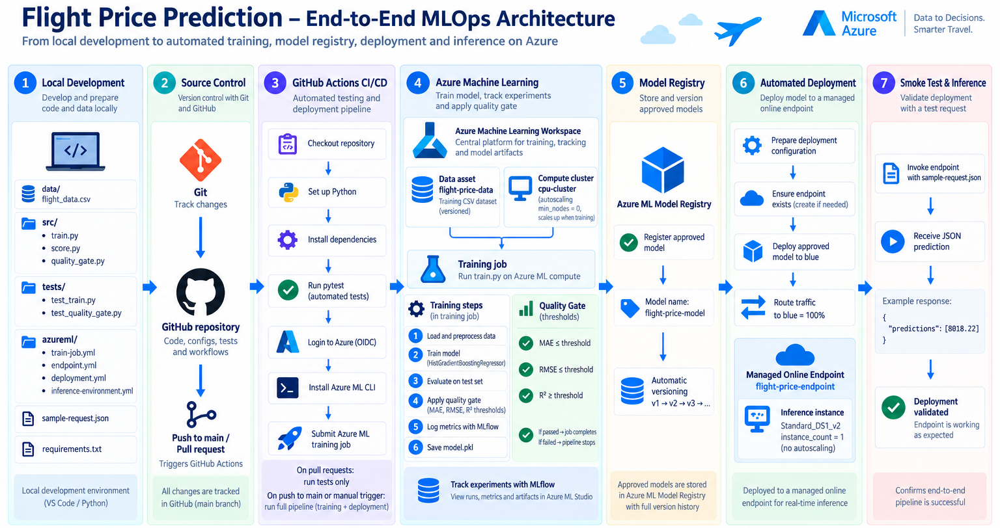

# Flight Price Prediction — End-to-End MLOps on Azure

An end-to-end MLOps project for training, validating, versioning, deploying, and testing a flight-price regression model with **Azure Machine Learning** and **GitHub Actions**.

The repository focuses on the operational ML lifecycle: source-controlled training code, automated testing, model-quality gates, MLflow experiment tracking, versioned model registration, managed online deployment, and post-deployment smoke testing are connected in one reproducible workflow.



> **Architecture note:** the `data/flight_data.csv` box in the diagram represents the local source dataset used during development. The dataset itself is not stored in this repository. Azure ML training consumes the registered data asset `flight-price-data:1`.

## What this project demonstrates

- **Reproducible model training** in Azure Machine Learning using a registered data asset and managed compute
- **Automated CI/CD** with GitHub Actions
- **Software validation** with `pytest`
- **Model quality control** using MAE, RMSE, and R² thresholds
- **Experiment tracking** with MLflow for training parameters and evaluation metrics
- **Versioned model registration** in Azure Machine Learning
- **Managed real-time inference** through an Azure ML online endpoint
- **Automated deployment** to the `blue` deployment with 100% endpoint traffic
- **Post-deployment smoke testing** using a representative JSON request
- **OIDC-based GitHub-to-Azure authentication** for the CI/CD workflow

## End-to-end workflow

| Stage | Implementation |
| --- | --- |
| **1. Local development** | Training, scoring, quality-gate logic, tests, Azure ML configuration, and the sample request are developed locally. |
| **2. Source control** | Git and GitHub version the source code, tests, YAML configuration, and workflow definition. |
| **3. Continuous integration** | Pull requests and pushes to `main` run the automated test suite with `pytest`. |
| **4. Azure ML training** | GitHub Actions submits a command job to Azure ML. The job uses `flight-price-data:1` and the `cpu-cluster` compute target. |
| **5. Model evaluation** | `train.py` calculates MAE, RMSE, and R² and writes the results to `outputs/metrics.json`. |
| **6. Quality gate** | `quality_gate.py` validates the metrics against explicit thresholds. A failed gate causes the Azure ML job to fail. |
| **7. Model registration** | If training and validation succeed, GitHub Actions registers `flight-price-model` with the next numeric version. |
| **8. Deployment** | The approved model is created or updated in the `blue` deployment behind `flight-price-endpoint`. |
| **9. Smoke test** | The deployed endpoint is invoked with `sample-request.json`; the workflow succeeds only if the response contains `predictions`. |

### Trigger behavior

- **Pull request to `main`** → automated tests only
- **Push to `main`** → tests + Azure ML training + quality gate + model registration + deployment + smoke test
- **Manual workflow dispatch** → full pipeline on demand

## Machine learning pipeline

The model is implemented as a scikit-learn `Pipeline`, keeping preprocessing and prediction logic together in the serialized model artifact.

### Input features

Categorical features:

- `airline`
- `source_city`
- `departure_time`
- `stops`
- `arrival_time`
- `destination_city`
- `class`

Numerical features:

- `duration`
- `days_left`

Target:

- `price`

`flight` is intentionally excluded from the baseline feature set because it behaves as a high-cardinality identifier rather than a generalizable predictive feature.

### Preprocessing and estimator

- Duplicate rows are removed before training
- Invalid target values are coerced to missing and removed
- Missing categorical values → most-frequent imputation
- Categorical variables → ordinal encoding with support for unseen categories
- Missing numerical values → median imputation
- Estimator → `HistGradientBoostingRegressor`
- Train/test split → 80/20 by default
- Random state → `42` by default
- MLflow → logs model type, split configuration, row counts, MAE, RMSE, and R²
- Serialized pipeline → `outputs/model/model.pkl`
- Evaluation metrics → `outputs/metrics.json`

The Azure ML job output is later used as the source for model registration. The training script does **not** explicitly log `model.pkl` as an MLflow artifact.

## Automated model quality gate

A trained model can proceed to registration and deployment only when all three acceptance criteria are satisfied:

| Metric | Acceptance rule |
| --- | ---: |
| R² | `>= 0.95` |
| MAE | `<= 2500` |
| RMSE | `<= 4500` |

The gate also fails if a required metric is missing or contains `NaN`.

Because the training command runs `train.py && quality_gate.py`, a failed quality gate produces a failed Azure ML job. The GitHub Actions workflow checks that job status before any model registration or deployment takes place.

## CI/CD pipeline

The GitHub Actions workflow contains two jobs.

### 1. Automated tests

The `test` job:

1. checks out the repository,
2. configures Python 3.10,
3. installs dependencies from `requirements.txt`, and
4. runs `python -m pytest -v`.

The tests cover both the executable training workflow and pass/fail behavior of the model-quality gate.

### 2. Train, register, and deploy

The `train-and-deploy` job runs only after the test job succeeds and does not run for pull requests.

It:

1. authenticates to Azure,
2. installs the Azure ML CLI extension,
3. submits `azureml/train-job.yml`,
4. streams and verifies the Azure ML job,
5. calculates the next model version,
6. registers the approved model,
7. prepares the deployment YAML with that model version,
8. creates the online endpoint if necessary,
9. creates or updates the `blue` deployment,
10. routes 100% of endpoint traffic to `blue`, and
11. invokes the endpoint as a smoke test.

This makes deployment conditional on both **software tests** and **model-performance validation**.

## Model serving

The endpoint configuration uses:

- Endpoint: `flight-price-endpoint`
- Authentication: `key`
- Deployment: `blue`
- Instance type: `Standard_DS1_v2`
- Instance count: `1`

The scoring script searches `AZUREML_MODEL_DIR` for `model.pkl`, loads the serialized scikit-learn pipeline with `joblib`, converts incoming records to a pandas DataFrame, and returns predictions as JSON.

### Example request

```json
{
  "data": [
    {
      "airline": "Vistara",
      "source_city": "Delhi",
      "departure_time": "Morning",
      "stops": "zero",
      "arrival_time": "Afternoon",
      "destination_city": "Mumbai",
      "class": "Economy",
      "duration": 2.25,
      "days_left": 10
    }
  ]
}
```

Example response shape:

```json
{
  "predictions": [8018.22]
}
```

The numeric value above is illustrative; the deployed model determines the actual prediction.

## Repository structure

```text
azure-flight-price-mlops/
│
├── .github/
│   └── workflows/
│       └── ci.yml
│
├── azureml/
│   ├── deployment.yml
│   ├── endpoint.yml
│   ├── environment.yml
│   ├── inference-environment.yml
│   └── train-job.yml
│
├── src/
│   ├── quality_gate.py
│   ├── score.py
│   └── train.py
│
├── tests/
│   ├── test_quality_gate.py
│   └── test_train.py
│
├── .gitignore
├── requirements.txt
├── sample-request.json
├── mlops-architecture.png
└── README.md
```

## Technology stack

| Area | Technology |
| --- | --- |
| Machine learning | Python, pandas, scikit-learn |
| Estimator | HistGradientBoostingRegressor |
| Experiment tracking | MLflow, Azure ML MLflow integration |
| Testing | pytest |
| Cloud ML platform | Azure Machine Learning |
| Training compute | Azure ML compute cluster |
| Model management | Azure ML Model Registry |
| Serving | Azure ML Managed Online Endpoint |
| CI/CD | GitHub Actions |
| Cloud authentication | GitHub OIDC / Azure federated identity |
| Deployment configuration | Azure ML CLI v2 + YAML |
| Serialization | joblib |

## Local validation

Install the project dependencies:

```bash
python -m pip install -r requirements.txt
```

Run the automated tests:

```bash
python -m pytest -v
```

The tests do not require the Azure ML training dataset. `test_train.py` generates temporary synthetic data to verify that the training workflow creates a model artifact, produces metrics, and returns predictions.

## Azure ML resources referenced by the project

| Resource | Configuration |
| --- | --- |
| Workspace | `aml-flight-price-mlops` |
| Data asset | `flight-price-data:1` |
| Experiment | `flight-price-regression` |
| Training job display name | `flight-price-baseline` |
| Compute | `cpu-cluster` |
| Registered model | `flight-price-model` |
| Online endpoint | `flight-price-endpoint` |
| Deployment | `blue` |
| Inference instance | `Standard_DS1_v2` |

## Engineering focus

This project is intentionally compact and focuses on the controls that move a machine-learning model from source code to a managed inference endpoint:

**test → train → evaluate → gate → register → version → deploy → verify**

The key design principle is that successful training alone is not enough to trigger deployment. The code must pass automated tests, and the trained model must satisfy explicit performance criteria before it is registered and served.
